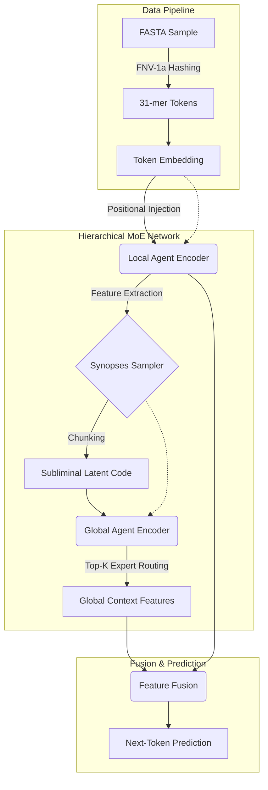

# Subliminal Learning MoE 

*A High-Performance Metagenomics Representation System leveraging Hierarchical Mixture-of-Experts and Subliminal Latent Injection.*

---

## Abstract

**Subliminal Learning MoE** is a prototypical DNA language model architecture designed to generate robust mathematical representations of massive genomic samples without the need for strict environmental labels during training. The system treats a biological sample as a "document" and its constituent $k$-mers as "words."  

By utilizing a dual-agent network—where **Local Agents** isolate sequence-level motifs and **Global Agents** synthesize multi-sequence synopses—the model captures highly complex, out-of-distribution biological novelty. During training, it explicitly projects a **subliminal latent code** specific to each sample, forcing the model to explain sample-wide variance. During inference, the learned model weights are frozen, and only the latent code is adapted to newly presented biological samples, establishing a mechanism for novelty detection through optimization gradients.

## System Architecture

The core of the system is the `TinyCausalTransformer`, which replaces traditional homogeneous attention layers with a **Hierarchical Mixture-of-Experts (MoE)** pipeline.



### Components
- **Local Agent Encoder**: Scans sequential $k$-mers to understand immediate genomic contexts.
- **Global Agent Encoder**: Operates over compressed representations ("synopses") mapping broad sample topologies.
- **Latent MoE Transformer**: Implements a balanced routing layer (`MoEFeedForward`), injecting the subliminal code to guide dynamic expert selection.

## Installation & Execution

This repository strictly adheres to modern PEP 621 Python packaging standards.

### 1. Environment Setup

Ensure you are using Python 3.10+ and a CUDA/MPS-enabled device.

```bash
# Clone the repository
git clone https://github.com/vyshakbellur/subliminal_learning_Vyshak.git
cd subliminal_learning_Vyshak

# Install dependencies using standard pip packaging
pip install .
```

### 2. Execution Protocol

Train on in-domain samples, evaluate on all samples:

```bash
python src/hierarchical_moe_lm.py \
  --train-fasta data/samples/*.fna.gz \
  --eval-fasta  data/samples/*.fna.gz \
  --kmer 31 --stride 1 --vocab-size 32768 \
  --epochs 5 --d-model 64 --layers 2 --heads 4 \
  --train-block 256 --embed-block 512 \
  --code-dim 64 --adapt-steps 60 --adapt-lr 0.2 \
  --save outputs/run1 \
  --device auto
```

### 3. Generated Artifacts

Executing the pipeline yields the following telemetry and representation artifacts:
- `embeddings_latent.npy`: The continuous subliminal codes for each sample space.
- `embeddings_pooled.npy`: Mean-pooled token embeddings from the model body.
- `samples_summary.csv`: Pre- and post-adaptation perplexity arrays to track structural novelty.
- `samples_pca2.csv`: Principal component topology map of the target dimensions.

---
*Developed by Vyshak Athreya. See `pyproject.toml` for extended dependencies.*
