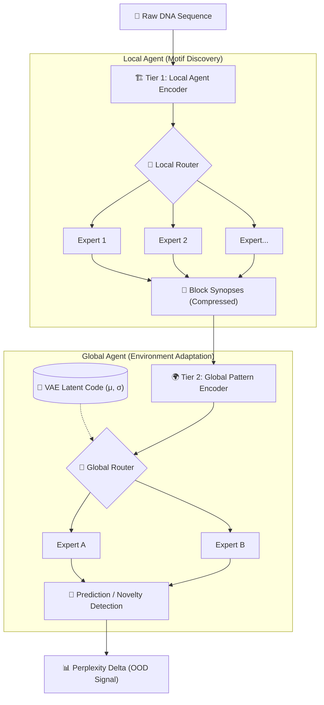

# Architecture: Hierarchical Hybrid Mixture-of-Experts (MoE)

The **Hierarchical Hybrid MoE** is a dual-layered language model designed to process extremely long metagenomic sequences while simultaneously adapting to specific environments using a latent routing mechanism.

## Overview

Traditional transformers struggle with the massive context required for genomic sequences. Our architecture overcomes this using a **two-tier hierarchical approach** coupled with **Mixture-of-Experts (MoE)** routing.

### tier 1: Local Agent Encoder (DNA Motif Recognition)
The **Local Agent** processes small, overlapping chunks (synopses) of the DNA sequence (e.g., 16-token blocks).
- **Dynamic Experts**: Each layer of the Local Agent consists of 8 independent "Experts."
- **Sequence Spezialization**: A router dynamically directs tokens to the experts best suited for their specific DNA motifs.
- **Goal**: Compress local sequence structures into high-dimensional "synopsis tokens."

### tier 2: Global Pattern Encoder (Environmental Adaptation)
The **Global Agent** processes the synopses generated by the Local Agent, effectively seeing the "global" structure of the entire sequence.
- **Latent Routing**: Routing decisions are influenced by a **Sample-Specific Latent Code** (an embedding representing the sample's environment).
- **Adaptation**: For Marine vs. Freshwater samples, the Global Agent triggers different sets of experts to handle the pattern recognition.
- **Fusion**: Global insights are fused back into the local token stream to refine the final next-token prediction.

## Subliminal Learning Mechanism

The "Subliminal Learning" aspect of the architecture allows the model to adapt to new environments without retraining the entire language model.

1. **Training**: The model is trained on diverse genomic data, learning both the DNA language and the latent codes for the training environments.
2. **Inference (Zero-Shot Adaptation)**: When the model encounters a new sample (e.g., a genomic sequence from a previously unseen environment):
   - The **Language Model weights are frozen**.
   - Only the **Latent Code** is optimized to minimize the prediction error (perplexity) on the new sample.
   - The speed and success of this adaptation serve as a powerful signal for **Out-of-Domain (OOD) novelty detection**.

## Variational Latent Space (VAE-MoE)

The recent upgrade from fixed lookup embeddings to a **Variational Latent Space** significantly improves the model's ability to cluster biologically similar samples.

1. **Parameterization**: Instead of a single vector, the latent code now outputs a Mean ($\mu$) and Log-Variance ($\log\sigma^2$).
2. **Reparameterization Trick**: During training, the model samples from this distribution ($z = \mu + \epsilon \cdot \sigma$), allowing it to explore the environment "manifold" rather than memorizing specific samples.
3. **KL-Divergence Regularization**: A penalty term ($KL$) is added to the loss function, pressuring the latent space to stay compact. This prevents "overfitting" to a specific sample and forces the model to group samples with similar DNA grammars.

## Environmental Variance and Novelty Detection

Our 40-sample high-resolution validation (20 Marine vs. 20 Freshwater) reveals a critical biological insight:

- **Marine Diversity (bioGEOTRACES)**: Marine metagenomes show high variance in the latent space. This is expected as the samples originate from geographically distinct ocean provinces (Arctic, Tropical, Coastal). The model correctly represents this as a broad, distributed "Marine language."
- **Freshwater Unity**: In our dataset, Freshwater samples form a tight, localized cluster. This indicates a more unified genomic signature compared to the diverse Marine set.
- **Novelty Signal**: Despite the internal variance of Marine samples, the Freshwater cluster remains spatially distinct. This "separation" proves the model's ability to identify environmental shifts in a zero-shot manner by optimizing only the latent $\mu$ vector while freezing the language model weights.

## Key Benefits

- **Efficiency**: Map-Reduce style processing handles long-range dependencies with lower memory cost than standard attention.
- **Interpretability**: VAE-regularized clustering provides direct biological insights into environmental shifts and sample similarity.
- **Performance**: Mixture-of-Experts (MoE) provides massive model capacity with a low computational footprint per token.
